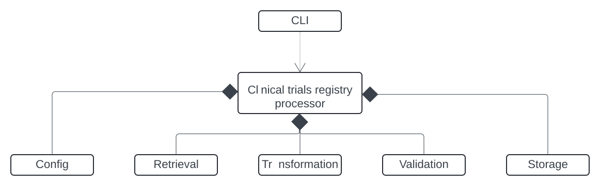

# Trial Synth

Interpretation and integration of clinical trials data from multiple registries in a computable form

## Adding registries and processors

Getting data of each registry happens via a corresponding `Processor` object, its components, and relevant methods and functions.
Users create a `Processor` by composition; some require different work than others.

Some common components include:

- Fetcher: get raw data from a source (e.g. a REST API)
- Transformer: change the data into a desired format for downstream use
- Storer: save the data to some location(s)
- Validator: check the data for quality
- Configuration: management of processor behaviors
- CLI: entrypoint for downstream use



A user can add a registry and `Processor` by test-driven development. A pattern for doing this looks like:

- Get a sample response from the API and save it to a file
- Write the test for API stability
  - This can detect unexpected API behavior (e.g. changes or outages)
- Add the file to the imposter to use as a stubbed response
  - Add a new port for the stubbed service to the imposter and compose files
- Write the test for the processor's end-to-end behaviors
  - The input is the sample response
- Write the components and functions to make the test pass
  - Set the `url` environment variable for the `Processor` to the stub's port

## Installation

Run the following to install this repository's package in editable mode:

```bash
$ git clone https://github.com/gyorilab/trialsynth
$ cd trialsynth
$ pip install -e
```

## Local run

Users can run all system components on their computers via the compose stack, wrapped by a shell script:

```bash
./run_e2e.sh
```

## Testing

Users can run all the suite of full system tests on their computers via the compose stack, wrapped by a shell script:

```bash
./test_e2e.sh
```

## References

[Test-driven development](https://tidyfirst.substack.com/p/canon-tdd)
[Mountebank](https://www.mbtest.org/)
